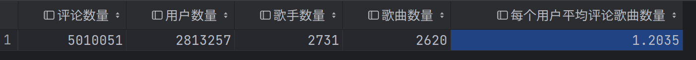

# NetEase Cloud Music Dataset for RecSys

dependence
- scrapy
    crawl website
- requests
    used to demonstrate how to crawl NetEase Cloud Music website
- mariadb
    used to store data in mariadb database in the pipeline of scrapy

demo.jsonl contains a little data in JSON Line fomrat to demonstrate

the whole data can be download at release

overview.sql can help you to have a overview of the dataset

